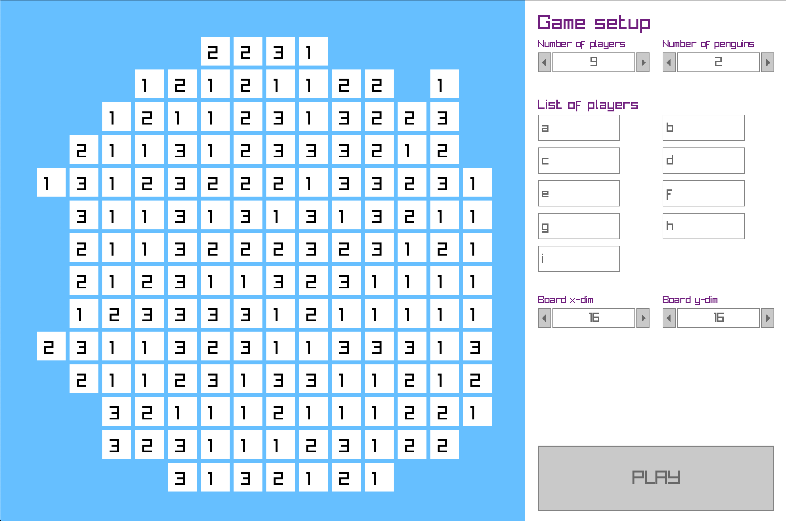
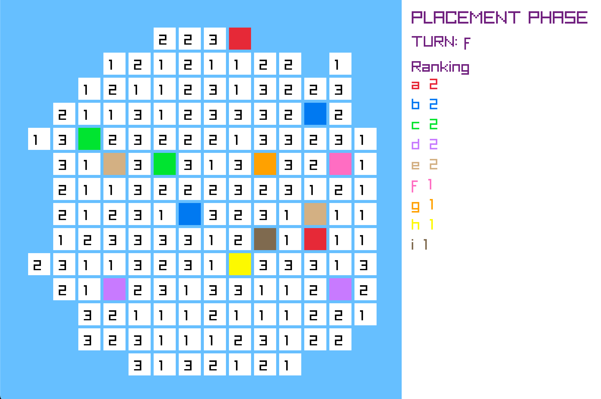
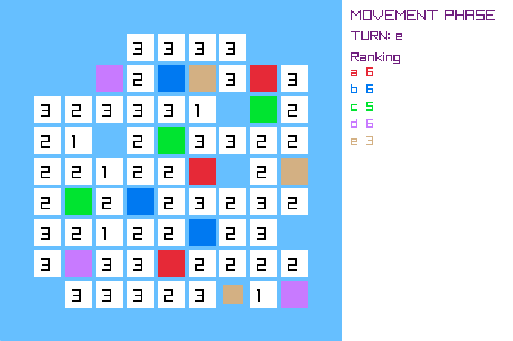

# epfu21Z-103-B-penguins

# Project “Penguins”

Game instruction

1.This is a simplified version of board game “Hey, that’s mine fish".  
2.Game is played in turns - in each turn each player moves one penguin. The aim is to collect themost fish.  
3.The game board is arranged in a square grid with m rows and n columns. Each field of the gridcan be empty or can have an ice floe with 1, 2 or 3 fish on it.  
4.Each game is played on a new, possibly randomly generated, board. Each player has a certain(known) number of penguins.  
5.There are two phases of the game:  
a) Placing the penguins on the board;  
b) Playing the game.  
6.Placing the penguins:  
a)In a single turn the player places one of his penguins on an unoccupied ice floe with exactlyone fish on it.  
b)When placing the penguin, the fish on the target ice floe is collected by the player andremoved from the ice floe. This way the ice flow with a penguin does not have any fish.  
c)The move is compulsory.  
d)The placing phase ends when all the penguins are placed on the game board.  
7.Playing the game:  
a)In his turn, the player chooses one of his penguins and moves it in a straight line (only alongthe grid lines) to another unoccupied ice floe.   The previous ice floe is removed from theboard. The move over the field without ice floe or over other penguin is forbidden. Whenplacing the   penguin, the fish on the target ice floe is collected by the player and removedfrom the ice floe, immediately.  
b)If possible, the move is compulsory.  
c)Game ends when no penguin can make a move.  
8.The player who collects the most fish wins.  

# Game "Penguins" with GUI

This game relays on the GUI library called Raylib, which is cloned from GitHub during configuration.

To configure, run
    `./configure`

To build, run
    `./build`

To run, run
    `./run`

# Gameplay gallery

