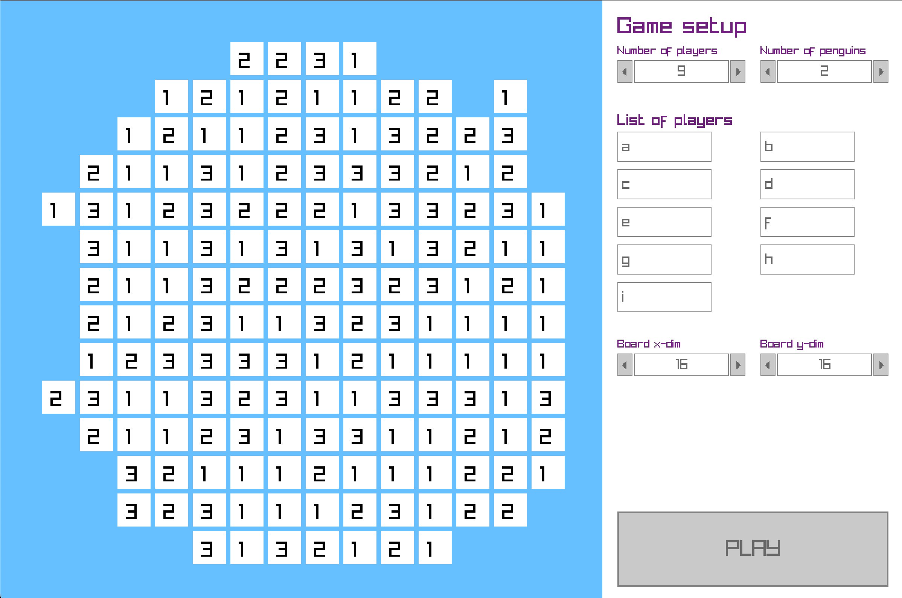

# Game "Penguins" with GUI

This game relays on the GUI library called Raylib, which is cloned from GitHub during configuration.

To configure, run
    `./configure`

To build, run
    `./build`

To run, run
    `./run`

# Gameplay gallery

